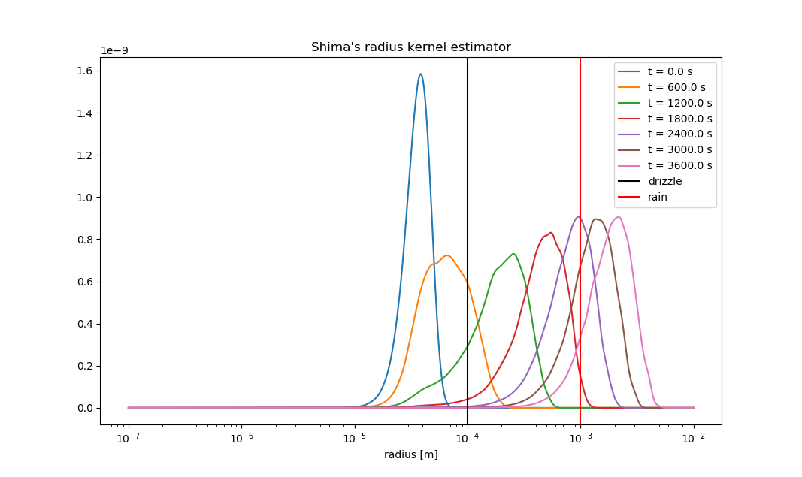

# ShimaCoalescence
A Python implementation of the super-droplet Monte Carlo method of droplet coalescence simulation [originally developed by S.Shima, K. Kusano, A. Kawano, T. Sugiyama and S. Kawahara in 2009](https://doi.org/10.1002/qj.441). Uses Numba under the hood.

Run via `python Shima.py`, set initial conditions in `config.py`.

Needs some cleaning up, but works decently well.

# Results

